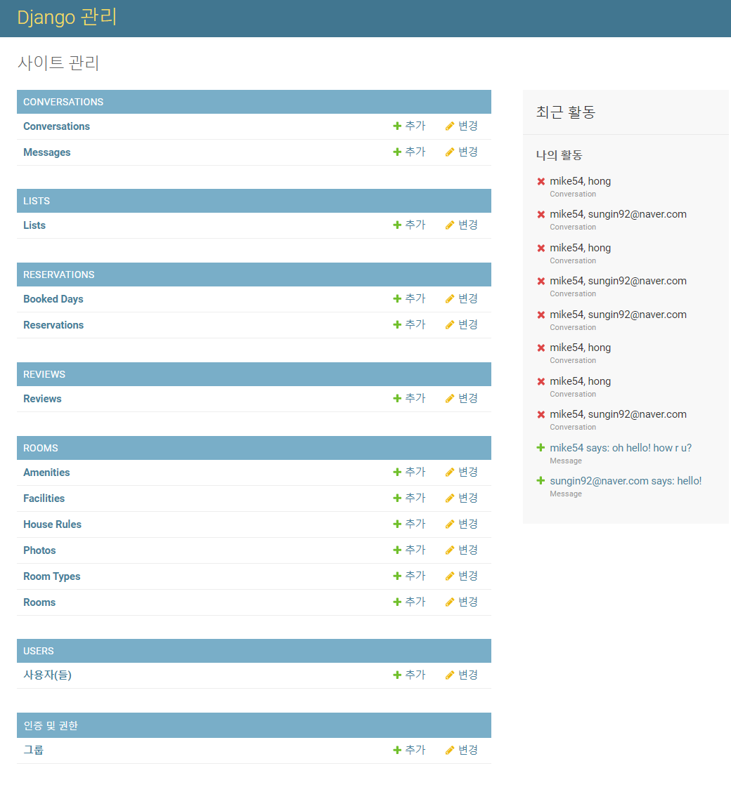
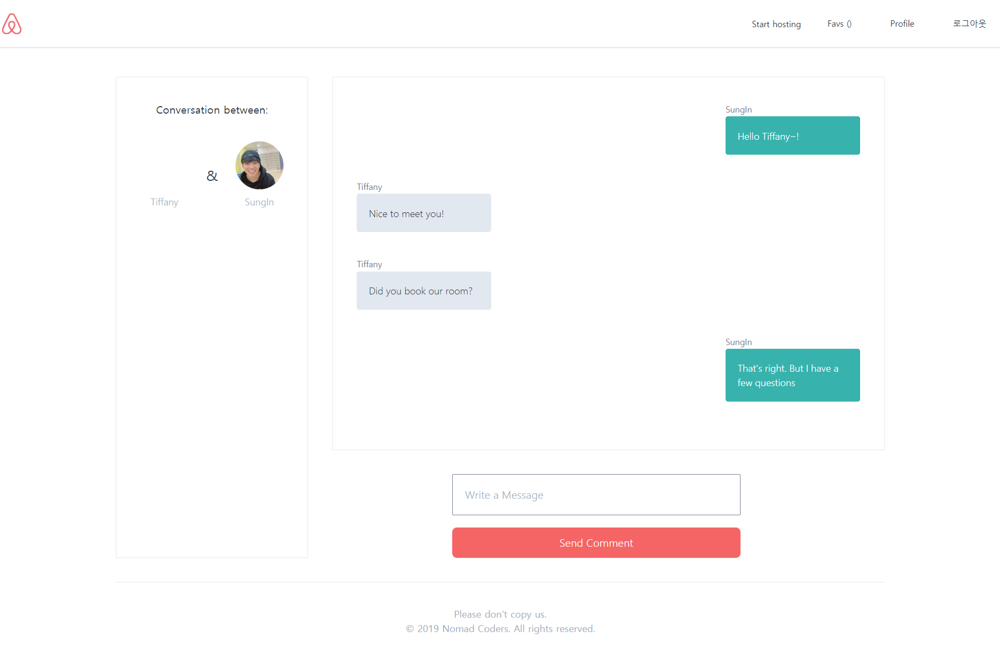

# Django FrameWork Lecture

### CAirbnb

 

Cloning Airbnb using Python, Django, Tailwind and more.. 
This is a result of [Nomad Coders Academy](https://academy.nomadcoders.co/) lecture.

#### Try it out

#### Features

1. Django Admin Site
2. Log In , Sign Up
3. User Profile
4. Room, Review
5. Reservation, Conversation

#### Screenshots

1. Django Admin Site 
   
2. Log In, Sign Up 
   
   

3. User Profile 
   

4. Room, Review 
   

5. Reservation, Conversation 
   
   
