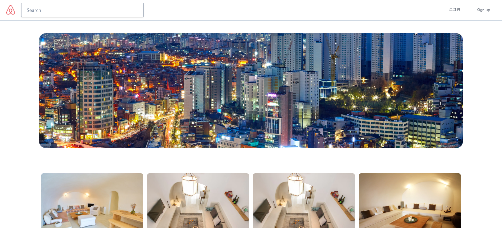
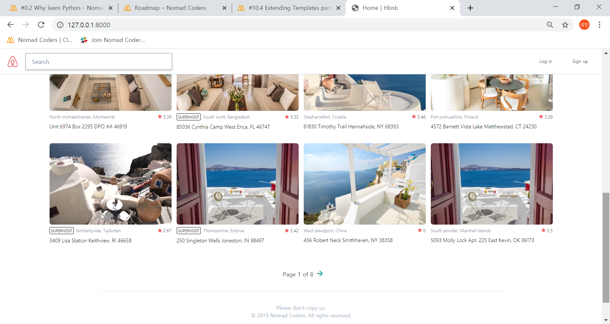
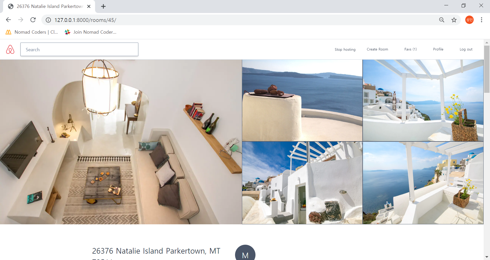
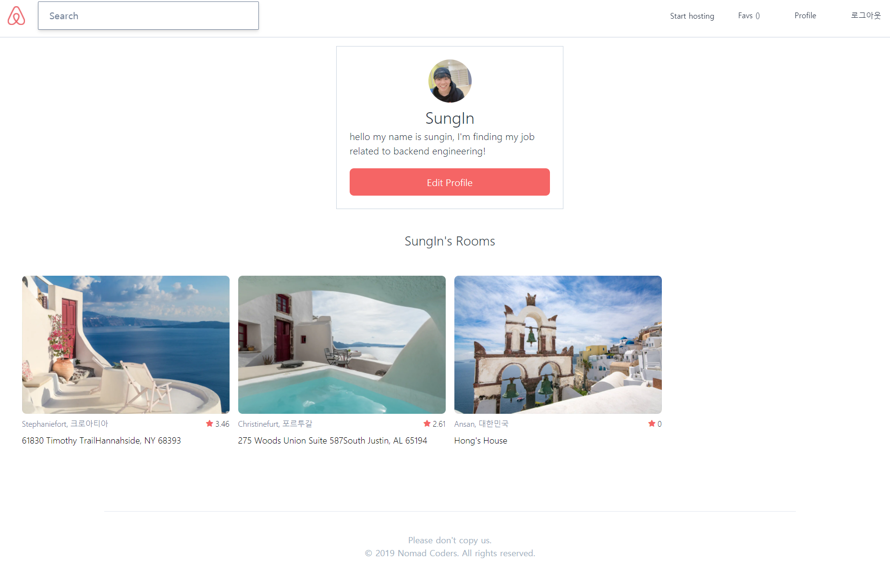
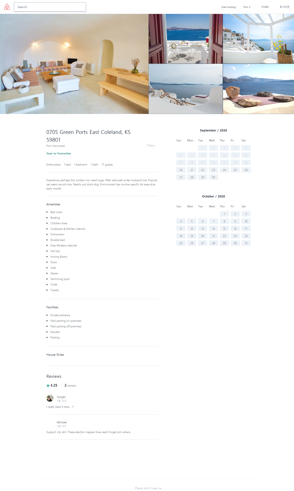

# Airbnb Clone

Cloning Airbnb using Python, Django, Tailwind and more.. through Nomad Coders Academy  
(Nomad Coders Academy : https://academy.nomadcoders.co/)

### Course Curriculum
- 0 INTRODUCTION
- 1 ENVIRONMENT SETUP
- 2 INTRODUCTION TO DJANGO
- 3 USER APP
- 4 ROOM APP
- 5 ALL OTHER APPS!
- 6 ROOM ADMIN
- 7 MODELS AND QUERYSETS
- 8 MORE ADMINS!
- 9 CUSTOM COMMANDS AND SEEDING
- 10 INTRODUCTION TO VIEWS AND URLS
- 11 HOMEVIEW
- 12 DETAILVIEW
- 13 SEARCHVIEW
- 14 USER LOG IN & LOG OUT
- 15 SIGN UP
- 16 VERIFY EMAIL
- 17 LOG IN WITH GITHUB
- 18 KAKAO LOGIN
- 19 INTRO TO TAILWINDCSS
- 20 MAKE IT ALL BEAUTIFUL
- 21 USER PROFILE, EDIT PROFILE, CHANGE PASSWORD
- 22 ROOM DETAIL
- 23 UPDATE ROOM, CREATE ROOM, ROOM PHOTOS
- 24 RESERVATIONS AND REVIEWS
- 25 TRANSLATIONS, LISTS AND MESSAGES
- 26 DEPLOYMENT TO AWS (not completed)

    
    

    
    
    
    

